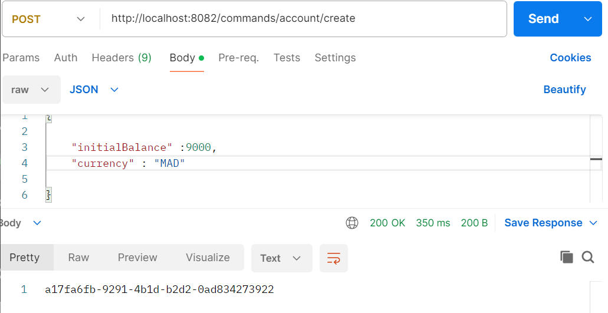
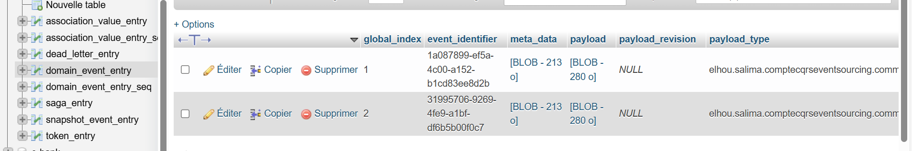
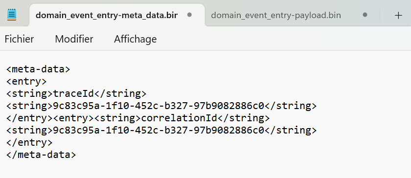
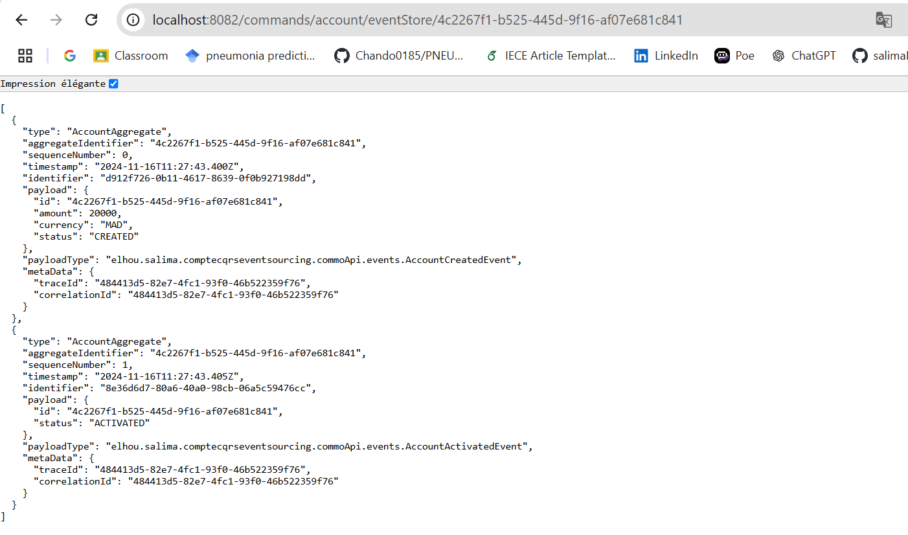
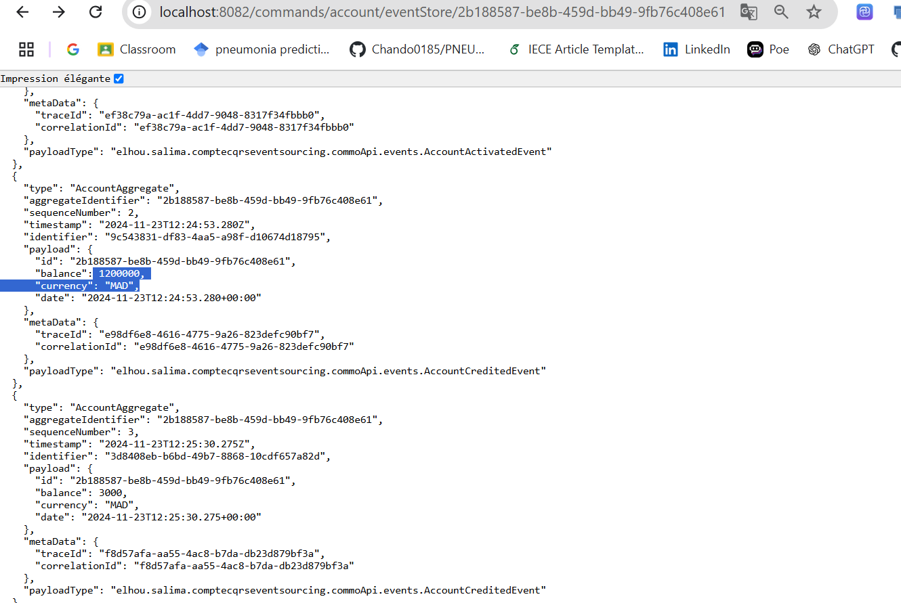
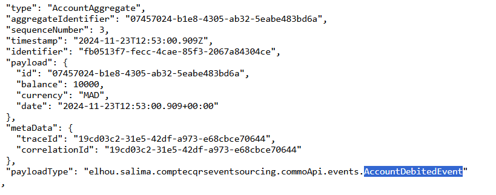
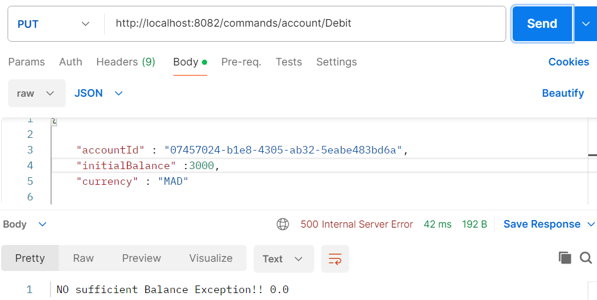
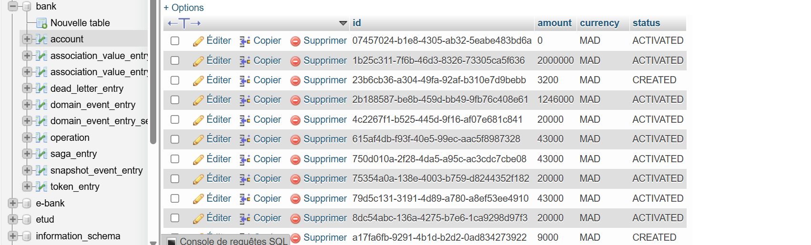
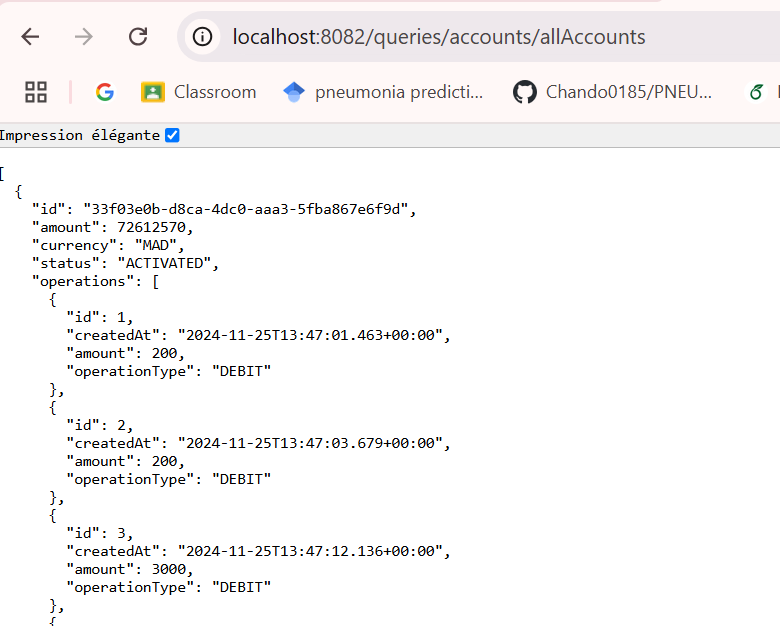
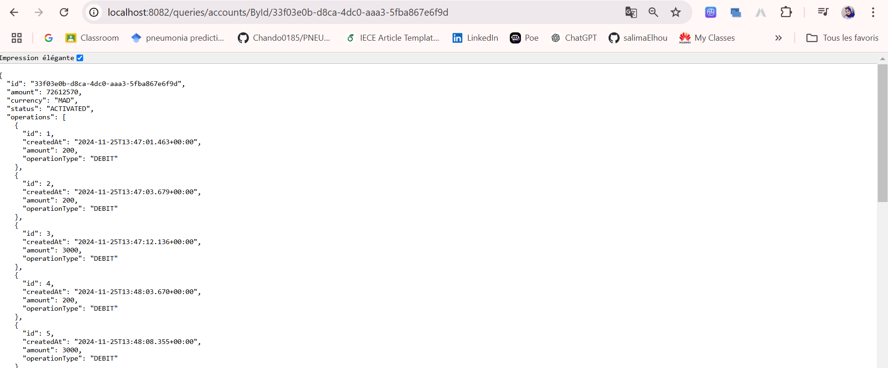

# Salma EZACCANI Master sdia 2

# Gestion de Comptes avec CQRS et Event Sourcing

## Structure du projet

## part 1 UI (Commandes CQRS):

**BD**

## part 2 

- ALL ACCOUNTS : 

- ACCOUNT BY ID :

